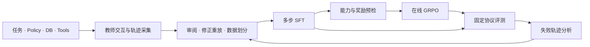

# PolicyAgent-PostTrain

**电商多步工具智能体的后训练与可靠性评测。**

[快速开始](#快速开始) · [系统设计](#系统设计) · [训练与评测](#训练与评测) · [技术报告](TECHNICAL_REPORT.md) · [文档](docs/README.md)

PolicyAgent-PostTrain 基于 [τ²-bench Retail](https://github.com/sierra-research/tau2-bench)，围绕订单取消、商品修改、退换货与退款等场景，连接教师轨迹构造、多步 SFT、在线 GRPO 和失败分析。

项目同时检查 **任务是否完成、写操作是否获得授权、最终告知是否符合真实状态**。一次工具调用返回成功，并不足以回答这三个问题。

## 核心能力

| 能力 | 实现 |
|---|---|
| 教师数据构造 | 模型与 Retail 环境交互生成轨迹，经审阅、修正重放、去重与数据划分后进入训练 |
| 多步 SFT | 保留工具调用和真实工具结果，桥接用户交互协议，对 assistant 目标进行 LoRA / QLoRA 监督训练 |
| Agentic GRPO | 在独立环境中生成完整多轮轨迹，进行组内相对奖励优化，支持参考模型 KL、梯度累积和运行完整性检查 |
| 可靠性评测 | 结合数据库状态差分、任务 Rubric、授权顺序和事实声明，输出可追溯的判定及失败原因 |
| 轨迹诊断 | 保存 Reward 分项、advantage、工具行为与训练日志，定位误判、提前结束、错误写入和重复调用 |
| 执行前防护 | 对模型的工具提案进行规则检查；Guard 与训练 Reward、离线评测使用独立入口 |

## 系统设计



τ²-bench 提供业务任务、数据库、工具、用户模拟器框架和基础评测。本仓库实现数据工作流、训练接入、状态重放、规则验证、执行防护及实验诊断；训练底层使用 PyTorch、Transformers、PEFT 和 TRL。

### 评测与奖励

- **终局结果**：检查必要操作及最终环境状态。
- **过程约束**：检查身份、用户意图、参数绑定、写前确认和非预期写操作。
- **结果告知**：检查交互是否完成，以及订单、金额、退款等声明是否有证据支持。

严格评测保留 `PASS / FAIL / REVIEW / ERROR / NOT_APPLICABLE` 等状态，区分模型错误与证据不足。训练支持 Terminal Reward 和分层 Reward；后者将多个过程检查汇总为**轨迹级标量**，不等同于逐动作 reward-to-go。具体公式与判定规则见[技术报告](TECHNICAL_REPORT.md)。

## 快速开始

Python 3.12。从公开仓库中的冻结证据运行一个离线示例，无需 GPU、模型权重或 API Key：

```bash
git clone https://github.com/FrankXIAO0108/PolicyAgent-PostTrain.git
cd PolicyAgent-PostTrain
python -m src.project_summary
```

示例展示 Retail 基线、状态差分、失败归因和 Guard 的离线检查，并输出源文件哈希。也可以导出 JSON：

```bash
python -m src.project_summary --format json --output output/demo/summary.json
```

需要实际重放工具、运行测试或训练时，继续阅读[安装与运行](docs/QUICKSTART.md)。

## 训练与评测

| 环节 | 代码入口 | 配置与说明 |
|---|---|---|
| 教师轨迹 | [教师生成](src/training/run_tau2_teacher_trajectory_smoke.py) | [配置导航](configs/README.md) |
| 数据发布 | [审阅后发布](src/training/release_owner_reviewed_teacher_batch.py) | [数据治理文档](docs/04_数据治理与后训练/) |
| SFT | [教师 SFT runner](src/training/run_teacher_sft.py) | [配置导航](configs/README.md) |
| GRPO | [Agentic GRPO runner](src/training/run_retail_agentic_grpo.py) | [运行说明](docs/QUICKSTART.md#训练入口) |
| 严格评测 | [任务评测器](src/evaluation/strict_task_evaluator.py) | [任务 Rubric](src/evaluation/task_rubric.py) |
| 训练曲线与审计 | [脚本导航](scripts/README.md) | [GRPO 审计](src/evaluation/grpo_training_audit.py) |

已完成的开发实验包括 Qwen3-4B 教师 SFT 与真实 Retail 在线 GRPO。技术报告提供模型起点、数据划分、训练参数、曲线和轨迹案例。目前尚未建立可信的 GRPO 业务提升结论；实验完成与效果验证分别报告。

完整训练需要另行准备模型、已发布的数据及用户模拟器凭证。仓库公开代码、配置和部分冻结证据，模型权重与完整云端产物不随 Git 分发。

## 可复现性

每轮实验绑定代码与上游版本、配置和数据哈希、模型 checkpoint、任务集合及采样参数。训练日志、原始轨迹和评测输出分别保存；失败分析可回到具体工具调用和状态变化。

Terminal 与 Staged 的比较应固定模型、任务、opening、采样预算和评测协议。不同 Reward 的训练分数不直接横比，最终比较任务完成率与过程违规情况。

## 目录

```text
src/                 数据、训练、环境接入、评测与 Guard
configs/             版本化配置与任务 Rubric
data/                公开合成样本、数据划分与 opening
tests/               单元测试与环境集成回归
scripts/             运行、绘图与诊断工具
docs/                使用说明、设计与实验文档
experiments/         冻结实验及审计证据
reports/             公开评测报告
TECHNICAL_REPORT.md   技术细节、实验分析与证据索引
```

## 参考

- [τ²-bench](https://github.com/sierra-research/tau2-bench)：Retail 交互环境与评测基础。
- [TRL](https://github.com/huggingface/trl) 与 [PEFT](https://github.com/huggingface/peft)：后训练与参数高效微调。
- [CommerceAgentBench](https://github.com/Accio-org/CommerceAgentBench)：业务工作流评测与任务级 Verifier 的设计参考。
