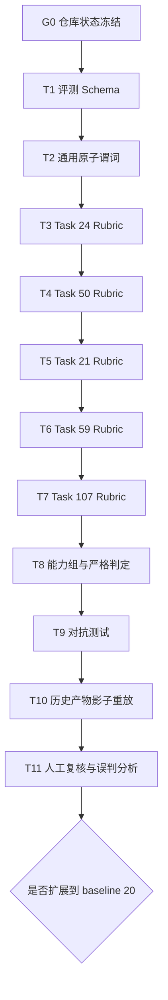

# Codex 执行边界与偏移控制

日期：2026-08-26
状态：待执行，当前停留在 `G0_WORKTREE_FREEZE`
适用范围：严格评测 P0 的设计、实现、测试与影子重放

## 1. 目的

本文档用于限制 Codex 在长周期开发中的任务偏移。它不取代
`AGENTS.md`，而是将其项目级原则收窄为当前严格评测 P0 的可执行边界。

基本原则：

```text
Codex 可以自主完成当前任务卡内的安全本地工作，
但不得自主修改任务卡、跳过门禁、扩大范围或开始后续实验。
```
## 2. 证据和冲突优先级

发生冲突时依次使用：

1. 当前仓库文件、Git 状态和原始产物；
2. `AGENTS.md`；
3. 本冻结执行规格与机器可读计划；
4. 有日期的项目决策文档；
5. 聊天记忆和未冻结计划。

不得使用历史聊天替代原始 artifact，不得根据目录名推断实验结果。

## 3. 严格评测 P0 冻结目标

只实现：

```text
5 条代表性 Retail 任务
-> 任务级 Rubric
-> 原子谓词
-> 固定能力组
-> 严格成功判定
-> Base / SFT / RL 历史产物的离线影子评测
```

代表任务：

- 21：确认阶段追加修改；
- 24：撤回取消操作，同时回答商品材质；
- 50：无法自行恢复已取消订单，必须转人工；
- 59：条件取消与地址修改；
- 107：两个订单的多步换货。

P0 显式不做：

- 不扩展到 baseline 20；
- 不修改现有 Tau2 reward 口径；
- 不将新评测结果接入 GRPO 梯度；
- 不运行云 GPU；
- 不调用 DeepSeek、Qwen 或其他外部 API；
- 不覆盖冻结的历史实验产物；
- 不把 Reference Action 当作唯一正确轨迹；
- 不宣称影子评测已获得生产级校准。

## 4. 当前仓库起点

本文档创建时的读取结果：

```text
branch: main
HEAD: d01e5e0b827dd0c4ccdca442015f2e7a6f24c55c
remote relation: main...origin/main [ahead 33]
working tree: dirty
```

现有未提交内容涉及 GRPO、Guard、Reward 审计、配置、数据与临时脚本。
这些修改在本计划中全部视为“既有工作”，不得由严格评测任务擅自修改、删除、
stash、reset 或合并。

因此当前唯一允许执行的任务是 `G0_WORKTREE_FREEZE`。

## 5. 执行状态机



只有当前任务的所有验收条件和人工批准都满足，才能进入下一状态。

## 6. 任务卡规范

每张卡必须包含：

- 唯一 `task_id`；
- 唯一主要目标；
- 允许修改的文件；
- 禁止操作；
- 必读证据；
- 必跑测试；
- 可机械检查的验收条件；
- 必须停止并请求决策的情况。

任务卡存储在
`configs/execution/strict_eval_p0_plan_v1.json`，该 JSON 是当前状态的机器可读来源。

## 7. 每轮开始协议

Codex 在修改任何文件前必须：

1. 读取 `AGENTS.md`、本文档和机器可读计划；
2. 执行 `git status --short --branch` 和 `git rev-parse HEAD`；
3. 核对 `current_task`、起点 HEAD 和工作区是否与计划一致；
4. 向用户复述当前目标、允许文件、禁止事项和验收条件；
5. 说明修改原因、文件和影响范围；
6. 若状态不一致，停止修改并报告。

## 8. 每轮执行边界

Codex 必须：

- 一次只执行一张任务卡；
- 只修改 `allowed_files`；
- 先跑聚焦测试，再根据任务卡决定是否跑更广回归；
- 计划外问题只写入 `open_questions`，不顺手修复；
- 保留原始产物，新输出使用新目录；
- 任务完成后停止，不得自动开始下一张卡。

Codex 不得：

- 因为某个问题“顺手可修”就扩大范围；
- 同时改动评测口径、训练数据、reward 和模型参数；
- 将缺失证据记为模型失败；
- 将单个 golden trajectory 视为唯一合法路径；
- 自动 commit、push、stash、reset、clean 或删除文件；
- 在未审批时启动云端、API 调用或付费实验。

## 9. 必停条件

出现任一条时必须停止：

1. 任务语义存在多种合理解释；
2. 原始轨迹、DB、Policy 或 Tool 返回不足以支持判定；
3. 需要修改 `allowed_files` 之外的文件；
4. 出现未知未提交修改；
5. 需要改变任务集、模型、评测器、reward 或实验协议；
6. 测试不能确认失败来自实现还是环境；
7. 当前规格与仓库事实冲突；
8. 需要覆盖、删除或替换已有 artifact。

## 10. 每轮收尾报告

每轮必须报告：

1. 实际修改的文件；
2. `git diff --stat` 和计划外文件检查；
3. 运行的完整测试命令与结果；
4. 验收条件逐项状态；
5. 原始证据路径；
6. 已确认事实、假设和未解决问题的分离说明；
7. 是否建议进入下一任务，但不得自动进入。

## 11. 严格评测数据合同

### 11.1 原子判定状态

```text
PASS
FAIL
REVIEW
NOT_APPLICABLE
ERROR
```

- `REVIEW` 不等于 PASS；
- `ERROR` 表示评测不完整，不等于模型失败；
- 不得动态删除失败能力组以改变分母。

### 11.2 固定能力组

```text
evaluation_integrity
final_state_correctness
required_task_execution
invalid_action_avoidance
protocol_compliance
intent_alignment
evidence_consistency
```

同一任务在 Base、SFT、RL 间必须使用相同 rubric、原子谓词和分母。
不同任务可有不同业务谓词，但必须聚合到上述固定能力组。

### 11.3 严格成功

```text
strict_pass = evaluation_valid
              AND 所有 required capability groups == PASS
```

`diagnostic_score` 只用于失败定位，不能代替 `strict_pass`，也不得在 P0
直接转换为 RL reward。

## 12. 任务级实现顺序

| 任务 | 唯一目标 | 主要验收点 |
|---|---|---|
| G0 | 冻结工作区起点 | 既有改动已分类，无擅自清理 |
| T1 | 定义 Schema | 合法配置可加载，错误配置 fail-fast |
| T2 | 通用确定性谓词 | 缺证据返回 ERROR，不误罚合法路径 |
| T3 | Task 24 | 正确处理撤回取消和静态 DB |
| T4 | Task 50 | 拒绝非法恢复，正确转人工并停止 |
| T5 | Task 21 | 确认阶段追加项与一次性写入一致 |
| T6 | Task 59 | 按最新用户意图判定，显式处理 static-gold 冲突 |
| T7 | Task 107 | 两订单换货、variant、payment 和一次性写入 |
| T8 | 聚合器 | 固定能力组、固定分母、strict pass |
| T9 | 对抗测试 | 覆盖漏调、多调、越权、假成功、意图变更和环境错误 |
| T10 | 离线影子重放 | 不覆盖原始结果，Tau2 与 strict 双口径输出 |
| T11 | 人工复核 | 逐条解释分歧，评估误报和漏报 |

## 13. 进入后续阶段的条件

P0 完成后仍不自动扩展 baseline 20，更不自动进入 RL。必须先确认：

1. 5 条任务均有版本化 rubric；
2. 所有关键判定可追溯到 DB、轨迹、Tool 返回、Policy 或人工决策；
3. Base/SFT/RL 使用相同口径；
4. 对抗测试通过；
5. 影子评测与原始 Tau2 的分歧已逐条复核；
6. 未出现不可接受的系统性误报或漏报；
7. 用户明确批准下一阶段。

## 14. 标准启动话术

后续交给 Codex 时使用：

```text
只执行 configs/execution/strict_eval_p0_plan_v1.json 中的 current_task。
开始前读取 AGENTS.md、Codex 执行边界文档和当前任务卡，核对 Git 状态。
先复述目标、allowed_files、forbidden_actions、acceptance 和 stop_conditions。
只完成当前卡，不得自动进入下一卡。
完成后报告 diff、测试、证据和未解决问题，等待人工验收。
```
