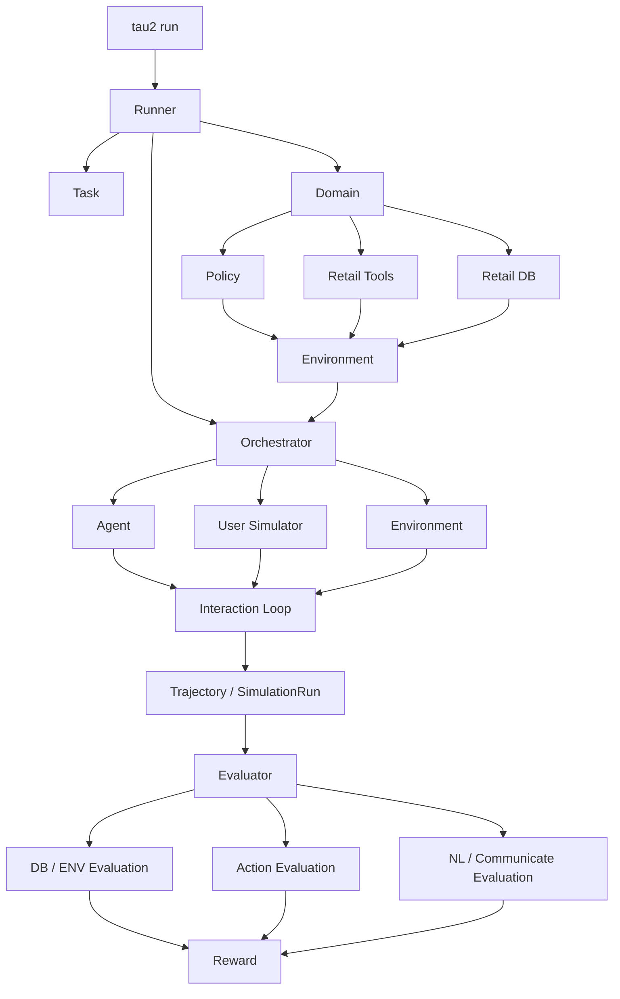
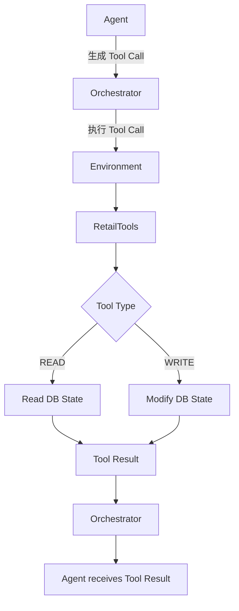
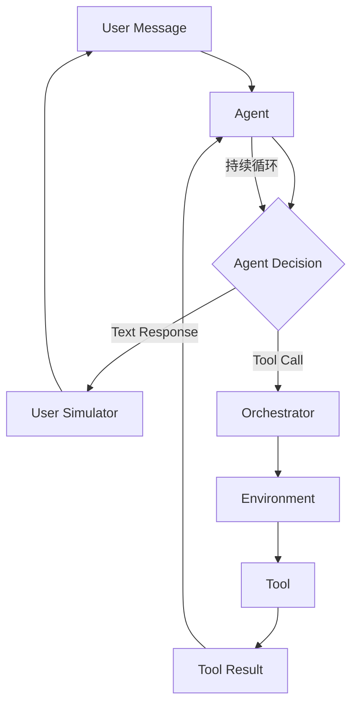
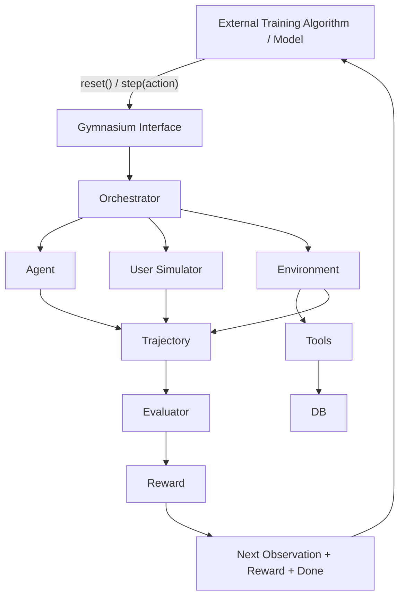
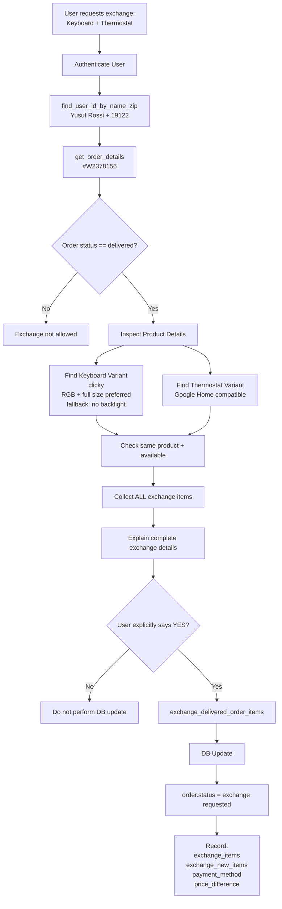
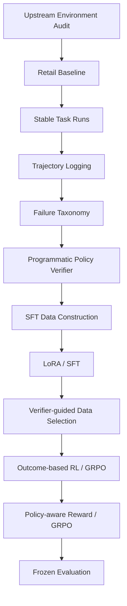

# τ²-bench Repository Architecture Map

## 1. 文档目的

本文记录 `PolicyAgent-PostTrain` 所依赖的 τ²-bench 上游仓库结构，以及 Retail Domain 中 Task、Policy、Tools、DB、Environment、Agent、Orchestrator、Trajectory、Evaluator 和 Gym 的关系。

当前阶段目标不是逐行阅读全部源码，而是建立一张稳定的代码地图，为后续工作提供基础：

- Retail Baseline
- Trajectory Logging
- Failure Taxonomy
- Policy Verifier
- SFT 数据构造
- Verifier-guided Data Selection
- GRPO / Post-training
- Frozen Evaluation

---

# 2. Upstream Baseline

Upstream Repository：

```text
sierra-research/tau2-bench
```

当前冻结 Commit：

```text
58e5e1ace69302e6982d27014569c03e0ffccdd2
```

对应提交：

```text
fix: make voice and knowledge dependencies truly optional (#197)
```

当前实际验证：

```text
git status
→ working tree clean

tau2 intro
→ 可正常执行

CLI reported version
→ tau-bench v1.0.0
```

环境：

```text
Python 3.12
uv
core + dev + gym dependencies
```

后续实验以 Git Commit 作为最可靠的上游版本标识：

```text
Git Commit
>
实际源码
>
CLI Version
>
CHANGELOG / RELEASE_NOTES
```

---

# 3. 当前项目范围

PolicyAgent-PostTrain 当前只聚焦：

```text
Retail Domain
+
Text Tool Agent
+
Policy-constrained Interaction
+
Trajectory
+
Evaluation
+
Post-training
```

当前阶段不进入：

```text
Voice
Audio Native
Banking Knowledge / RAG
Multimodal
Realtime Voice Providers
```

---

# 4. Repository Top-Level Structure

τ²-bench 核心源码：

```text
src/tau2/
├── agent/
├── api_service/
├── data_model/
├── domains/
├── environment/
├── evaluator/
├── gym/
├── knowledge/
├── metrics/
├── orchestrator/
├── runner/
├── scripts/
├── user/
├── utils/
└── voice/
```

本项目重点关注：

```text
agent/
data_model/
domains/
environment/
evaluator/
gym/
orchestrator/
runner/
user/
```

---

# 5. 总体代码架构图

## 5.1 主流程图



对应的文字结构：

```text
                              tau2 run
                                 │
                                 ▼
                               Runner
                                 │
                      ┌──────────┴──────────┐
                      ▼                     ▼
                    Task                  Domain
                                             │
                              ┌──────────────┼──────────────┐
                              ▼              ▼              ▼
                           Policy          Tools            DB
                              │              │              │
                              └──────────────┼──────────────┘
                                             ▼
                                        Environment
                                             │
                                             ▼
                                       Orchestrator
                              ┌──────────────┼──────────────┐
                              ▼              ▼              ▼
                            Agent      User Simulator   Environment
                              │              │              │
                              └──────────────┼──────────────┘
                                             ▼
                                         Interaction
                                             │
                                             ▼
                                         Trajectory
                                             │
                                             ▼
                                         Evaluator
                              ┌──────────────┼──────────────┐
                              ▼              ▼              ▼
                            DB/ENV          Action      NL/Communicate
                              └──────────────┼──────────────┘
                                             ▼
                                           Reward
```

---

# 6. 各模块职责

| 模块 | 作用 |
|---|---|
| Runner | 组装并启动一次实验 |
| Task | 描述用户想完成什么 |
| Domain | 定义具体业务世界 |
| Policy | 定义 Agent 必须遵守的业务规则 |
| DB | 保存当前业务状态 |
| Tools | 允许 Agent 查询或修改环境 |
| Environment | 将 Tool、State 等组合成可交互环境 |
| Agent | 决定下一步回复或 Tool Call |
| User Simulator | 模拟真实用户的下一轮行为 |
| Orchestrator | 控制 Agent、User、Environment、Tool 的交互 |
| Trajectory | 保存完整任务执行过程 |
| Evaluator | 对任务执行结果进行评测 |
| Reward | Evaluator 产生的评测/训练信号 |
| Gym | 将交互系统包装成 RL 可使用的 reset/step 接口 |

---

# 7. Runner

主要目录：

```text
src/tau2/runner/
```

Runner 是实验启动与组装层。

主要职责：

```text
读取运行配置
↓
加载 Domain
↓
加载 Task
↓
创建 Agent
↓
创建 User Simulator
↓
创建 Environment
↓
创建 Orchestrator
↓
运行 Simulation
↓
调用 Evaluator
↓
保存结果
```

典型 CLI：

```bash
tau2 run \
  --domain retail \
  --agent-llm <model> \
  --user-llm <model>
```

Runner 还负责：

```text
task split
seed
num trials
num tasks
concurrency
retry
result saving
```

因此：

```text
Runner ≠ Agent
```

Runner 负责“把实验跑起来”，Agent 负责“做决策”。

---

# 8. Task

Retail Task：

```text
data/tau2/domains/retail/tasks.json
```

当前确认：

```text
114 tasks
```

典型结构：

```text
Task
├── id
├── description
├── user_scenario
│   ├── persona
│   └── instructions
│       ├── task_instructions
│       ├── reason_for_call
│       ├── known_info
│       └── unknown_info
├── initial_state
└── evaluation_criteria
    ├── actions
    ├── communicate_info
    ├── nl_assertions
    └── reward_basis
```

必须区分：

```text
Task
→ 用户想做什么

Policy
→ 做这件事必须遵守什么规则

Evaluator
→ 系统最后如何判断任务执行情况
```

---

# 9. Domain

主要目录：

```text
src/tau2/domains/
```

Retail：

```text
src/tau2/domains/retail/
├── data_model.py
├── environment.py
├── tools.py
├── utils.py
└── __init__.py
```

对应数据：

```text
data/tau2/domains/retail/
├── policy.md
├── tasks.json
├── split_tasks.json
├── db.json
└── ...
```

Domain 可以理解为一个完整业务世界：

```text
Domain
├── Policy
├── Tools
├── Tasks
├── DB / State
└── Domain-specific Data Model
```

---

# 10. Retail Policy

文件：

```text
data/tau2/domains/retail/policy.md
```

当前已经确认的主要规则：

### Authentication

对话开始必须认证用户。

认证方式：

```text
email
```

或者：

```text
first name + last name + zip
```

---

### Information Access

认证之后才能提供：

```text
order
product
profile
```

等用户相关信息。

---

### Database Update Confirmation

执行以下数据库写操作前：

```text
cancel
modify
return
exchange
```

必须：

```text
列出操作详情
↓
获得用户明确确认 yes
↓
执行 Write Tool
```

---

### Tool Communication Rule

Policy 要求：

```text
一次最多一个 Tool Call
```

且 Tool Call 和面向用户的文本回复不能在同一步同时发生。

---

### Exchange Rules

换货要求：

```text
order.status == delivered
```

新 Item 必须：

```text
属于同一个 Product
+
是另一个 Variant
+
available
```

价格差需要合法 Payment Method。

Gift Card 必须有足够余额。

同一订单的 Exchange / Modify Tool 只能调用一次。

---

# 11. Retail DB

文件：

```text
data/tau2/domains/retail/db.json
```

DB 表示：

```text
当前 Retail 世界的真实业务状态
```

包含类似：

```text
Users
Orders
Products
Variants
Payment Methods
Addresses
Fulfillments
```

关系：

```text
Task
= 用户目标

Policy
= 业务规则

DB
= 当前现实状态
```

---

# 12. Environment

通用环境：

```text
src/tau2/environment/
```

Retail 入口：

```text
src/tau2/domains/retail/environment.py
```

可理解为：

```text
db.json
   ↓
RetailDB
   │
   ├── RetailTools
   │
policy.md
   │
   ▼
Environment
```

Environment 最终提供给 Orchestrator。

---

# 13. Retail Tools

文件：

```text
src/tau2/domains/retail/tools.py
```

Tools 分为：

```text
READ Tools
WRITE Tools
```

Task 0 涉及：

```text
find_user_id_by_name_zip
get_order_details
get_product_details
exchange_delivered_order_items
```

---

# 14. Tool Call 完整执行链路图



文字版：

```text
Agent
  │
  │ generates Tool Call
  ▼
Orchestrator
  │
  │ executes Tool Call
  ▼
Environment
  │
  ▼
RetailTools
  │
  ├── READ Tool
  │      │
  │      ▼
  │      DB
  │
  └── WRITE Tool
         │
         ▼
     DB State Change
         │
         ▼
      Tool Result
         │
         ▼
    Orchestrator
         │
         ▼
       Agent
```

核心区别：

```text
Agent
→ 决定做什么

Orchestrator
→ 调度并执行调用

Tool
→ 实现业务操作

DB
→ 保存真实状态
```

因此：

```text
Domain 中的 Tools
```

和：

```text
Orchestrator 执行的 Tools
```

不是两套工具。

---

# 15. Tool Enforcement

当前通过源码确认，部分 Policy 会由 Tool 强制。

以：

```text
exchange_delivered_order_items
```

为例。

### Delivered Check

```python
if order.status != "delivered":
    raise ValueError(...)
```

---

### Old Item Check

旧 Item 必须真实存在于订单中。

---

### Old/New Item 数量一致

```text
len(item_ids)
==
len(new_item_ids)
```

---

### Same Product

Tool 根据旧 Item 的：

```text
product_id
```

查找对应：

```text
new_item_id
```

因此设计上要求：

```text
同 Product 下的 Variant
```

---

### Availability

```text
variant.available == True
```

否则失败。

---

### Price Difference

```text
diff_price
=
Σ(new_price - old_price)
```

---

### Payment Method

Tool 根据：

```text
order.user_id
```

获取指定 payment method。

---

### Gift Card Balance

如果 Gift Card 余额不足覆盖差价，则失败。

---

### State Transition

成功后：

```text
order.status
delivered
↓
exchange requested
```

并记录：

```text
exchange_items
exchange_new_items
exchange_payment_method_id
exchange_price_difference
```

因此第二次调用 exchange 时，由于状态已经不再是 `delivered`，会被阻止。

---

# 16. Policy Rule vs Tool Enforcement

当前已经明确：

```text
Policy Rule
        ≠
Tool Enforcement
        ≠
Evaluator Check
```

部分规则：

```text
Policy 要求
+
Tool 也会强制
```

例如：

```text
订单必须 delivered
Variant 必须 available
Payment Method 必须有效
Gift Card 余额必须足够
```

但另一些规则 Tool 本身无法直接知道，例如：

```text
是否先认证用户

是否认证后才查询订单信息

是否在 Write Tool 前完整说明操作详情

用户是否明确回答 yes

是否一次只调用一个 Tool

是否同时发送了文本和 Tool Call
```

例如 Exchange Tool 的参数只有：

```python
exchange_delivered_order_items(
    order_id,
    item_ids,
    new_item_ids,
    payment_method_id
)
```

没有：

```text
authenticated=True

user_confirmed=True

conversation_history=...
```

因此很多 Policy 是：

```text
Trajectory-level Constraint
```

而不仅是：

```text
Tool-level Constraint
```

这将成为后续 Policy Verifier 的重要基础。

当前尚未完成 Evaluator 的完整审计，因此暂时不能断言：

```text
官方 Evaluator 完全不检查 Policy
```

也不能断言：

```text
官方 Evaluator 已完整覆盖 Policy
```

必须以后通过源码和实验验证。

---

# 17. Agent

主要目录：

```text
src/tau2/agent/
```

当前定位：

```text
LLMAgentState
LLMAgent
LLMGTAgent
LLMSoloAgent
```

普通 Baseline 当前重点关注：

```text
LLMAgent
```

Agent 主要负责：

```text
Message History
+
Policy / System Prompt
+
Tool Definitions
↓
LLM
↓
Next Action
```

Next Action 可能是：

```text
Natural Language Response
```

或者：

```text
Tool Call
```

---

# 18. User Simulator

主要目录：

```text
src/tau2/user/
```

User Simulator 根据：

```text
Task
User Scenario
Conversation History
```

生成下一轮用户行为。

因此 τ²-bench 是多轮：

```text
Agent
↕
User Simulator
```

交互，而不是一次问答。

---

# 19. Orchestrator

主要文件：

```text
src/tau2/orchestrator/orchestrator.py
```

当前确认核心类：

```text
BaseOrchestrator
Orchestrator
```

重要方法：

```text
initialize()
step()
run()
_execute_tool_calls()
get_trajectory()
get_messages()
_check_termination()
_finalize()
```

Orchestrator 是整个 Interaction Loop 的调度器。

---

# 20. Interaction Loop



抽象形式：

```text
Observation
↓
Agent Decision
↓
Action
↓
Environment / User Feedback
↓
New Observation
↓
Agent Decision
↓
...
↓
Termination
```

---

# 21. Trajectory

整个任务过程形成：

```text
Trajectory
```

可能包含：

```text
User Messages
Agent Messages
Tool Calls
Tool Results
Conversation Order
Environment-related execution information
```

Final Result 主要告诉我们：

```text
任务有没有做成
```

Trajectory 则告诉我们：

```text
任务是怎么做的
```

因此后续：

```text
Failure Taxonomy
Policy Verifier
SFT Data
Preference Data
RL Data
```

都依赖 Trajectory。

---

# 22. Evaluator

目录：

```text
src/tau2/evaluator/
```

当前定位：

```text
evaluator.py
evaluator_env.py
evaluator_action.py
evaluator_communicate.py
evaluator_nl_assertions.py
```

总入口：

```text
evaluate_simulation()
```

目前可初步理解：

```text
Evaluator
├── DB / Environment Evaluation
├── Action Evaluation
├── Communicate Evaluation
└── NL Assertion Evaluation
```

Task 中：

```text
evaluation_criteria
```

包含：

```text
actions
communicate_info
nl_assertions
reward_basis
```

当前仅完成架构定位。

尚未完成：

```text
官方 Reward 精确组合逻辑

Golden Actions 的精确判定方式

DB Reward 是否主要比较最终状态

Action Reward 是否要求严格顺序

Policy Compliance 实际覆盖范围
```

这些问题留待后续 Evaluator Audit。

---

# 23. Gym / RL 接口架构图

Gym 不是：

```text
Evaluator
↓
Reward
↓
Gym
```

这种线性关系。

Gym 实际上是对整个交互系统的外层封装。



文字版：

```text
                  External Training Algorithm
                           / Model
                              │
                              ▼
                      Gymnasium Interface
                              │
                   reset() / step(action)
                              │
                              ▼
                        Orchestrator
                   ┌──────────┼──────────┐
                   ▼          ▼          ▼
                 Agent     User Sim   Environment
                                         │
                                         ▼
                                       Tools
                                         │
                                         ▼
                                        DB
                   └──────────┬──────────┘
                              ▼
                          Trajectory
                              │
                              ▼
                          Evaluator
                              │
                              ▼
                            Reward
                              │
                              ▼
             Observation + Reward + Done
                              │
                              ▼
                  External Training Algorithm
```

简化 RL 视角：

```text
Observation
↓
Policy / Model
↓
Action
↓
AgentGymEnv.step(action)
↓
Orchestrator
↓
User / Tools / Environment
↓
Next Observation + Reward + Done
```

因此：

```text
Gym
≠
新的业务 Environment
```

而是：

```text
训练算法
↕
τ²-bench 交互系统
```

之间的接口层。

---

# 24. Retail Task 0 端到端流程图

Task 0：

```text
用户：
Yusuf Rossi
ZIP: 19122

订单：
#W2378156

目标：
1. 更换机械键盘
2. 更换 Smart Thermostat
```

完整业务流程：



文字版：

```text
User requests:
exchange keyboard + thermostat
        │
        ▼
Authenticate user
find_user_id_by_name_zip
        │
        ▼
Get order
get_order_details
        │
        ▼
Check:
order.status == delivered
        │
        ▼
Inspect products / variants
get_product_details
        │
        ├── same product
        ├── requested options
        └── available
        │
        ▼
Collect ALL exchange items
        │
        ▼
Explain complete exchange details
        │
        ▼
Obtain explicit user YES
        │
        ▼
exchange_delivered_order_items
        │
        ▼
DB update:
status = "exchange requested"
exchange_items = [...]
exchange_new_items = [...]
payment_method = ...
price_difference = ...
```

Task 0 当前看到的 expected actions：

```text
find_user_id_by_name_zip

get_order_details

get_product_details

get_product_details

exchange_delivered_order_items
```

但当前不能仅根据 `evaluation_criteria.actions` 就断言：

```text
Evaluator 强制要求真实 Agent
严格按照完全相同顺序调用这些 Tool
```

必须后续读取 Evaluator 逻辑并通过实验验证。

---

# 25. Task 0：正常轨迹与违规轨迹示例

正常轨迹：

```text
Authenticate
↓
Get Order
↓
Inspect Products
↓
Collect All Items
↓
Explain Exchange Details
↓
User says YES
↓
Exchange Tool
↓
Correct DB State
```

潜在违规轨迹：

```text
直接 Get Order
↓
没有先认证
↓
Inspect Products
↓
没有获得 explicit YES
↓
直接 Exchange Tool
↓
DB State 仍可能正确
```

后续需要验证：

```text
Tool 是否阻止？
↓
Official Evaluator 是否发现？
↓
Policy Verifier 是否发现？
```

这将成为后续 PolicyAgent-PostTrain 的关键实验问题之一。

---

# 26. 三层约束模型

后续分析每一条业务规则时，统一分成三层：

```text
                 Policy Rule
                     │
           “业务规定应该怎样做”
                     │
          ┌──────────┴──────────┐
          ▼                     ▼
   Tool Enforcement       Evaluator Check
   “Tool 会不会拦截”      “官方评分会不会发现”
          │                     │
          └──────────┬──────────┘
                     ▼
               Policy Verifier
          “还缺哪些轨迹级检查”
```

核心关系：

```text
Policy Rule
        ≠
Tool Enforcement
        ≠
Evaluator Check
```

后续 Policy Verifier 的目标不是重复 Tool 已经能检查的全部逻辑，而是定位：

```text
Policy 明确要求
+
Tool 无法完整强制
+
官方 Evaluator 未充分覆盖
```

的轨迹级约束。

是否真的存在该缺口，必须通过后续源码与实验验证。

---

# 27. Gym 与后续 Post-training 的关系

当前规划：

```text
Retail Environment
        ↓
Baseline Agent
        ↓
Trajectory
        ↓
Failure Analysis
        ↓
Policy Verifier
        ↓
SFT
        ↓
Verifier-guided Data Selection
        ↓
RL / GRPO
        ↓
Frozen Evaluation
```

Gym 的位置：

```text
RL / GRPO Algorithm
        │
        ▼
Gym Interface
        │
        ▼
τ²-bench Interaction Environment
        │
        ▼
Trajectory + Reward
        │
        └────────────→ RL / GRPO Update
```

当前阶段只确认 Gym 的架构位置。

具体：

```text
GRPO 如何接入
Reward 如何构造
Trajectory 如何转 rollout
Verifier 如何进入 reward
```

留到后续计划阶段验证。

---

# 28. Verified Code Entrypoints

## Retail Data

```text
data/tau2/domains/retail/policy.md
data/tau2/domains/retail/tasks.json
data/tau2/domains/retail/split_tasks.json
data/tau2/domains/retail/db.json
```

## Retail Code

```text
src/tau2/domains/retail/environment.py
src/tau2/domains/retail/tools.py
src/tau2/domains/retail/data_model.py
src/tau2/domains/retail/utils.py
```

## Agent

```text
src/tau2/agent/llm_agent.py
```

已定位：

```text
LLMAgentState
LLMAgent
LLMGTAgent
LLMSoloAgent
```

## Orchestrator

```text
src/tau2/orchestrator/orchestrator.py
```

已定位：

```text
BaseOrchestrator
Orchestrator
```

重要方法：

```text
initialize()
step()
run()
_execute_tool_calls()
get_trajectory()
get_messages()
_check_termination()
_finalize()
```

## Evaluator

```text
src/tau2/evaluator/
```

包括：

```text
evaluator.py
evaluator_env.py
evaluator_action.py
evaluator_communicate.py
evaluator_nl_assertions.py
```

## Gym

```text
src/tau2/gym/
```

用于：

```text
Gymnasium-compatible RL interface
```

## Runner

```text
src/tau2/runner/
```

用于：

```text
simulation build
batch execution
experiment running
```

---

# 29. 当前已确认的关键认知

### 1. Task、Policy、Evaluator 是三件不同的事

```text
Task
→ 用户目标

Policy
→ 行为规则

Evaluator
→ 成功判定
```

---

### 2. Tool Call 不是 Agent 自己执行的

```text
Agent
↓
Tool Call
↓
Orchestrator
↓
Environment
↓
Tool
↓
DB
```

---

### 3. Tool 正确不等于 Policy 一定合规

```text
Tool Success
≠
Policy Compliance
```

---

### 4. Final State 和 Trajectory 不是同一层信息

```text
Final State
→ 最后发生了什么

Trajectory
→ 整个过程是怎么发生的
```

---

### 5. Gym 是外层训练接口，不是 Reward 后面的模块

```text
RL Algorithm
↕
Gym
↕
Orchestrator / Environment / User / Tools
```

---

# 30. 当前阶段未解决的问题

以下问题不能提前下结论：

```text
1. Official Evaluator 的 Reward 精确组合公式是什么？

2. Golden Actions 是严格匹配 Tool Trajectory，
   还是用于构造目标 Environment State？

3. DB Reward 是否主要比较最终 DB 状态？

4. Action Evaluator 是否要求：
   - Tool 名完全一致
   - 参数完全一致
   - 顺序完全一致
   - 不允许额外 Tool Call

5. Authentication、Explicit Confirmation 等 Policy
   是否被官方 Evaluator 实际检查？

6. 是否存在：
   Outcome Correct
   but
   Policy Violating
   的官方高分轨迹？

7. Gym 与最终 GRPO 训练循环如何连接？
```

这些留到后续计划阶段通过：

```text
源码审计
+
真实任务运行
+
Badcase 构造
```

验证。

---

# 31. 项目后续链路



当前完成：

```text
Upstream Environment Audit
✅

Repository Architecture Mapping
✅
```

尚未进入：

```text
单任务正式 Baseline
⏸
```

---

# 32. 7/21 阶段结论

通过当前仓库阅读，已经建立以下完整主干认知：

```text
tau2 run
↓
Runner
↓
Task + Domain
↓
Policy + Tools + DB
↓
Environment
↓
Orchestrator
↓
Agent / User / Tool Interaction
↓
Trajectory
↓
Evaluator
↓
Reward
```

同时确认：

```text
Gym
```

不是主流程最末端的新业务模块，而是：

```text
对整个交互过程进行 reset()/step() 包装
```

供后续强化学习算法使用。

当前代码地图已经能够支撑下一阶段：

```text
Retail 单任务 Baseline
```

但 Evaluator 精确逻辑、Policy Compliance 覆盖范围以及 Gym → GRPO 的具体训练连接方式，必须在后续计划阶段继续用源码和实验验证。