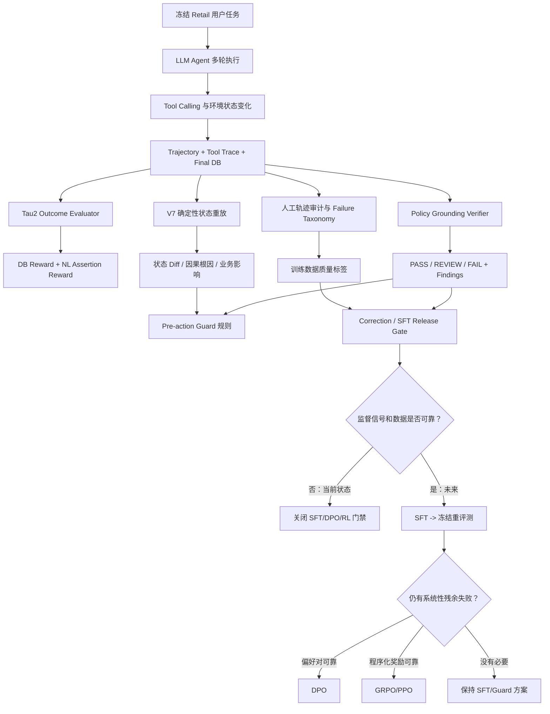

# PolicyAgent-PostTrain 完整工程复盘

> 面向项目复盘与大模型算法实习面试。
> 当前事实边界：项目完成了 Tool Agent 基线、轨迹审计、确定性状态重放、
> Programmatic Verifier、Pre-action Guard 和后训练数据门禁；没有完成 SFT、
> DPO、PPO、RLHF 或 GRPO 训练。

## 0. 阅读方法与证据边界

这不是一个“从零实现 tau2-bench”的项目。上游
`sierra-research/tau2-bench` 提供 Retail 任务、政策、工具、数据库、Agent/User
交互编排和基础 evaluator；本仓库实现实验冻结、轨迹审计、状态重放、失败归因、
政策验证、执行前防护和后训练数据治理。

面试时必须区分三类数字：

1. **冻结原始结果**：20 个开发任务，16 成功、4 失败、0 系统失败；
2. **开发集诊断结果**：V7 与 20 个冻结结果重放一致，V2.2 与 20 条
   provisional 标签一致；
3. **正式泛化结果**：当前不存在，因为独立 adjudicated gold 为 0，未完成
   held-out Verifier/Guard 泛化评测。

---

# 第一部分：项目整体背景与目标

## 1. 项目名称

**PolicyAgent-PostTrain：面向政策约束型 Tool Agent 的可靠性评测、执行防护与后训练数据治理。**

更适合面试的短名称是：

> 电商售后 Tool Agent Reliability & Post-training Infrastructure

## 2. 项目解决的问题

电商售后 Agent 会查询订单、修改地址、取消订单、退货和换货。它的输出不是普通
文本，而是带真实副作用的工具调用。项目解决的核心矛盾是：

```text
工具调用成功
!= 用户授权正确
!= 业务政策合规
!= 最终数据库状态正确
!= Agent 最终陈述真实
!= 可安全用于后训练
```

例如 Task 107 中，Agent 提交了旧商品与新商品 ID 相同的换货。Tool 接受了调用，
但 Retail Policy 要求换成不同商品选项。这是 Agent、Policy、Tool 与 Evaluator
四层失配，不是简单 prompt bug。

## 3. 为什么需要这个项目

只看最终 reward 会产生三类风险：

- `reward=0` 不一定是 Agent 错误。Task 59 是 User Simulator 最终意图与静态
  golden 冲突；
- `reward=1` 不一定是好轨迹。Task 16、29、76、109 最终结果成功，但包含并行
  写工具或一次性修改约束违规；
- Tool 返回成功不代表副作用正确。Task 98 的支付方式和操作范围出现问题，
  Task 21/37 还暴露环境返回状态污染。

如果直接把这些 reward 当成 SFT、DPO 或 GRPO 标签，模型会学习错误行为，
RL 还可能把奖励漏洞进一步放大。

## 4. 业务场景

场景是 tau2-bench Retail 的多轮客服 Tool Agent：

- 用户通过模拟器提出动态、多目标售后请求；
- Agent 根据政策和上下文选择工具、构造参数；
- Tool 修改订单或账户状态；
- evaluator 检查数据库结果与自然语言断言；
- 本项目在此基础上补充轨迹质量、政策合规、状态完整性和最终陈述检查。

典型业务风险包括：

- 把商品级取消扩大为整单取消；
- 使用错误支付/退款渠道；
- 选择错误商品变体；
- 未经明确确认执行写操作；
- 并行写导致部分成功、状态不一致；
- Tool 接受政策禁止的操作；
- Agent 对 Tool 实际结果作虚假或过时陈述。

## 5. 在大模型生态中的位置

### 5.1 Agent

本项目中的 Agent 是以 LLM 为推理核心、通过多轮消息和 Tool Calling 改变 Retail
环境状态的系统。代码入口和运行产物主要来自：

- `src/run_retail_baseline20.py`
- `experiments/20260722_110504_retail_baseline20_trial1_deepseek/`

### 5.2 LLM Agent Evaluation

项目不只评答案文本，而是评完整闭环：

```text
用户意图 -> Agent proposal -> Tool 参数 -> Tool 结果
        -> 最终 DB -> 最终声明 -> Policy
```

确定性重放位于 `src/evaluation/`；轨迹语义与政策检查位于
`src/verifiers/`。

### 5.3 Policy Grounding

Policy Grounding 指模型能否把自然语言业务政策转换为当前状态下的可执行约束。
项目中的约束包括：

- 每轮最多一个 Tool Call；
- Tool Call 轮不能同时输出用户可见文本；
- 写操作必须获得明确确认；
- 商品级请求不能无授权扩大为订单级副作用；
- 换货必须使用不同且可用的商品选项；
- 某些订单写操作每单只能执行一次。

### 5.4 Verifier

Verifier 是一个结构化判定器，不负责生成回答，而是读取轨迹证据并输出
`PASS / REVIEW / FAIL`、finding、severity 和证据位置。核心实现：

- `src/verifiers/policy_grounding_v0.py`
- `src/verifiers/policy_grounding_v1.py`
- `src/verifiers/policy_grounding_v2.py`
- `src/verifiers/gold_validation.py`

### 5.5 Reward Model 与 RLHF 思想

本项目当前没有训练神经 Reward Model，但体现了 RLHF 的核心前置思想：

1. 奖励必须代表真正偏好/目标，而不只是可被投机的 proxy；
2. 标注质量、冲突裁决和 held-out 验证先于优化；
3. Outcome、Policy、State、Claim 应拆成多维信号；
4. 奖励不可靠时，正确动作是关闭训练门禁，而不是强行跑 RL。

Programmatic Verifier 可以成为未来 reward 的一个组件，但当前不能直接称为
Reward Model，也未被批准进入 RL reward。

### 5.6 Post-training

项目位于“训练前的数据与奖励基础设施”阶段：

```text
Prompt Baseline
-> Audit / Taxonomy
-> Verifier / Guard
-> Corrected and adjudicated data
-> SFT
-> Frozen Base-vs-SFT evaluation
-> residual failures + reliable reward?
-> DPO or GRPO
```

`src/training/` 实现了 correction、quality adjudication、SFT release 和
readiness gate，但当前所有训练门禁保持关闭。

---

# 第二部分：完整项目技术路线

## 1. 总体流程图



## 2. 模块级输入、输出与必要性

| 模块 | 输入 | 输出 | 为什么需要 | 没有它的后果 |
|---|---|---|---|---|
| Task Freeze | 任务池、配置、版本 | 固定 task IDs、hash、manifest | 保证可比性 | 调参后换题，指标不可解释 |
| Agent Runner | task、policy、tool schema、LLM | 多轮消息和 tool calls | 产生真实闭环行为 | 只能做静态问答，无法观察副作用 |
| Tool Environment | tool arguments、初始 DB | tool result、最终 DB | 承载业务状态变化 | 无法验证执行是否真正完成 |
| Tau2 Evaluator | final DB、NL assertions | DB/NL/overall reward | 提供上游 outcome 基线 | 失去统一任务完成标准 |
| Trajectory Audit | 原始 messages、tools、reward | case dossier、taxonomy | 找到 reward 背后的首个偏离点 | 把所有 reward=0 当同一种错 |
| V7 Replay | Agent/Gold actions、初始状态 | 两份最终状态、structured diff | 确定性还原副作用 | LLM Judge 容易被流畅文本误导 |
| Failure Attribution | diff、messages、policy | primary cause、secondary finding、impact | 区分因果根因与连锁后果 | 每个不同字段都被误当独立 bug |
| Policy Verifier | observed trajectory | verdict、finding、severity | 检查授权、调用结构和政策 | outcome 成功的违规轨迹被放过 |
| Pre-action Guard | 当前用户范围、observed state、proposal | ALLOW/确认/重生成/阻止/转人工 | 在副作用发生前阻止高风险动作 | 只能事后发现业务损失 |
| Human Adjudication | blind packet、两位 reviewer | adjudicated label/conflict | 建立可信 gold | 规则对自身开发标签自证 |
| SFT Data Gate | quality label、correction hash、split | release/blocked | 避免脏数据进入 imitation learning | 模型复制违规、环境污染和错误标签 |
| Readiness Gate | SFT、comparison、preference、reward manifests | SFT/DPO/RL ready 状态 | 让训练由证据触发 | 为补齐技术名词而盲目 RL |

## 3. Reward 的分层

项目没有把所有信号压成一个标量，而是先分层：

```text
Outcome reward
  - DB 是否达到目标
  - NL assertion 是否满足

Process / policy signal
  - 授权、确认、调用数量、调用顺序、业务约束

State integrity signal
  - Tool 返回和最终 DB 是否与目标一致

Claim consistency signal
  - Agent 最终陈述是否与 Tool/DB 一致

Training eligibility
  - GOLD / SILVER / SUSPECT / MIXED / NEGATIVE / EXCLUDED
```

未来若构造 RL reward，也应先保留这些分量，观察 reward hacking 和 trade-off，
而不是立刻做未经验证的加权求和。

---

# 第三部分：项目时间线总览

详细问题模板见
[失败实验与版本迭代复盘](../02_评测与失败分析/失败实验与版本迭代复盘.md)。完整演进如下：

| 时间/阶段 | 版本或产物 | 发现 | 决策 |
|---|---|---|---|
| 2026-07-18 | 环境基线 | tau2 正式 tag 会提前导入可选 Voice 依赖 | 固定可运行 upstream commit |
| 2026-07-21 | Smoke5 | 3/5，且风险分层样本不代表总体 | 只作为工程烟测，不报正式成功率 |
| 2026-07-22 | Baseline20 Trial-1 | 16/20；Task 59/95/98/107 失败 | 冻结原始结果，逐条审计 |
| 2026-07-22 | Taxonomy v2 | reward=0 混合 benchmark、Agent、Policy 问题 | 不把 raw reward 直接当训练标签 |
| 2026-07-22 | Quality Taxonomy | reward=1 也有过程/环境问题 | 建立 GOLD/SILVER/SUSPECT 等门禁 |
| 2026-07-24~25 | Policy Grounding V0/V1/V1.2 | 9 FAIL、11 REVIEW、0 PASS；存在误报漏报 | 做规则级人工审计，不宣称可靠 |
| 2026-07-26 | LLM Verifier/V6 | accuracy 75%，漏掉全部 4 个 outcome failure | 用确定性 DB 重放重建官方结果 |
| 2026-07-26 | V7 Evaluation | 与 20 个冻结 outcome 一致，0 新 LLM call | LLM 只辅助解释，不覆盖确定性结果 |
| 2026-07-26 | Guard v1 | 离线拦截 3 个非隔离失败 | 建立执行前保护，但不声称在线修复 |
| 2026-07-27 | Policy Grounding V2.0 | V1.2 看不到 Guard 的 Task 95 规则 | Guard 与 Verifier 共享 runtime-safe 规则核 |
| 2026-07-27 | V2.1/V2.2 | Task 37/1 的跨轮确认误判 | 修复实体/上下文继承和 scope-only reconfirmation |
| 2026-07-28~29 | Review/Data Gates | 20 条仅 provisional，0 adjudicated | 正式指标、SFT、DPO、RL 全部保持关闭 |
| 2026-07-30 | Guard 合成场景诊断 V1 | 原 20 条审计不能证明场景迁移 | 新增 15 个独立于原轨迹的合成回归场景；15/15 通过，但不冒充 held-out gold |
| 2026-07-30 | Guard 在线 A/B Preflight V1 | 旧 Runner 只有 Guarded arm，无法排除采样变化 | 冻结 Base/Guarded 配对协议、干预 trace 和结果比较器；付费执行保持阻塞 |

版本命名注意：

- 仓库有明确产物的早期版本是 `Policy Grounding V1` 和 `V1.2`；
- **没有独立冻结、可报告指标的正式 V1.1 产物**，不要在面试中编造；
- 当前 `policy_grounding_v1.py` 内部标记为 V1.3，是后续实体/上下文修复后的
  V1 系列代码；
- 组合 Guard 规则的主线是 V2.0 -> V2.1 -> V2.2。

---

# 第四部分：Baseline 实验深度复盘

## 1. Baseline 是什么

Baseline 是在任何针对性优化前，对固定任务、固定模型和固定运行协议得到的参照
结果。它用于回答：

- 当前系统到底有多好？
- 哪些失败是稳定的，哪些是采样敏感的？
- 后续改动是否真的改善，而不是换题、换模型或修改 judge？

## 2. 当前 Baseline 配置

| 项目 | 值 |
|---|---|
| Domain | Retail |
| Role | Prompt Base / Trial-1 |
| Task | 20 个从 train split 冻结的开发任务 |
| Agent | `deepseek/deepseek-chat`, temperature 0 |
| User Simulator | `deepseek/deepseek-chat`, temperature 0 |
| NL Judge | `deepseek/deepseek-chat`, temperature 0 |
| Seed | 300 |
| Max steps | 200 |
| Trials | 1 |
| Concurrency | 1 |
| Upstream commit | `58e5e1ace69302e6982d27014569c03e0ffccdd2` |
| 官方 test | 未使用 |

Manifest：
`experiments/20260722_110504_retail_baseline20_trial1_deepseek/run_manifest.json`

## 3. 为什么必须固定

一次改动若同时改变 Agent 模型、User 模型、Judge、Prompt、任务集和 seed，
指标变化无法归因。冻结协议把后续比较约束成：

```text
同任务 + 同环境 + 同 evaluator + 单一目标变量
```

不能直接优化 test，因为一旦看过 test badcase 并据此改 prompt/rule/data，test
就变成开发集。此时分数只能说明“记住了已见失败”，不能说明泛化。

## 4. Baseline 结果

- 完成：20/20；
- 业务成功：16；
- 业务失败：4；
- 系统失败：0；
- success rate / mean reward：80%；
- 总模型成本：约 0.04471 美元；
- 总模拟时长：约 506.24 秒；
- 失败任务：59、95、98、107。

这是开发基线，不是官方 leaderboard 分数。20 个任务样本也不足以给出稳定的
生产成功率估计。

## 5. 四个失败的统一视图

| Task | 任务核心 | Agent/系统错误 | 类型 | Verifier/改进 |
|---|---|---|---|---|
| 59 | 两个订单的动态取消/修改决策 | User Simulator 最终确认与静态 golden 冲突 | Benchmark alignment / label noise | 检测 latest intent vs static gold，隔离，不作普通负样本 |
| 95 | 两台 laptop 换到目标规格 | 把 `available: bool` 当成“只有一件库存”，提前转人工 | schema semantics、completion、reasoning | variant resolver + actionable transfer Guard |
| 98 | 换货支付与取消请求 | 支付方式与目标不一致；商品请求存在整单副作用/最终陈述风险 | payment、scope、claim-state、mixed badcase | 参数绑定、scope confirmation、post-tool state/claim check |
| 107 | 两个订单换货 | 同 item 换同 item，选择错误 variant；Tool 仍接受 | Policy grounding + Tool enforcement gap | pre-tool same-item/different-option rule |

## 6. 为什么不能用 80% 直接指导训练

四个 `reward=0` 中：

- 59 不应作为普通 negative；
- 98 需要分段和重标；
- 95、107 可作为修正轨迹或 preference 候选，但不能只给一条负轨迹；

而 `reward=1` 中也发现 Task 16、21、29、37、72、76、109 等政策或环境风险。
所以训练数据映射必须是：

```text
Raw Reward
-> Evidence Audit
-> Outcome/Policy/State/Claim multi-label
-> Trajectory Quality
-> Correction and Adjudication
-> Training Eligibility
```

## 7. 当前项目结论

最值得面试表达的不是“80% 提升到了多少”，因为训练尚未发生；而是：

> 我发现 benchmark reward 不能直接代表真实业务正确性，于是建立了确定性状态
> 重放、Policy Verifier、Pre-action Guard 和 fail-closed 数据门禁。在监督信号
> 不可靠时，我选择关闭 SFT/RL，而不是制造不可解释的 checkpoint。

---

## 延伸阅读

- [失败与版本迭代复盘](../02_评测与失败分析/失败实验与版本迭代复盘.md)
- [Verifier、Reward 与大模型算法基础](../05_求职与面试/大模型算法基础与Verifier复盘.md)
- [项目表达、30 题模拟面试与知识地图](../05_求职与面试/项目表达与模拟面试题.md)
